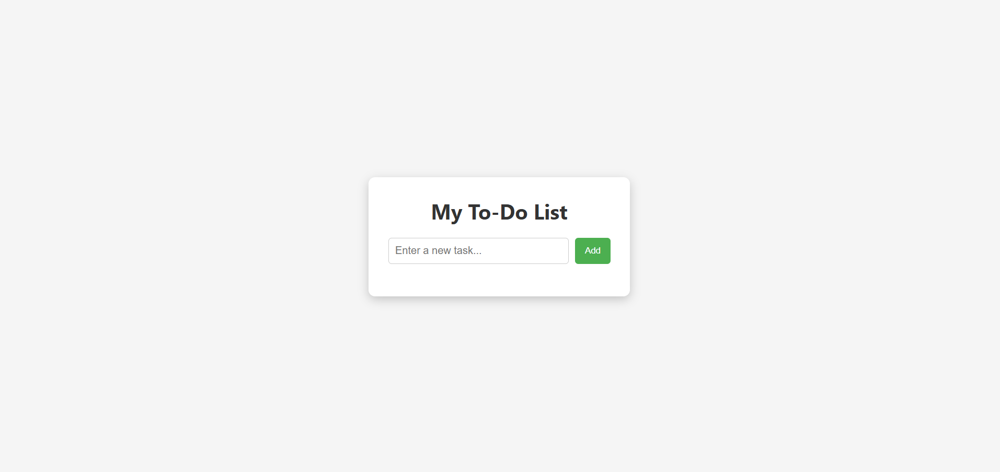

# To-Do List App

A clean and interactive to-do list built using **HTML**, **CSS**, and **JavaScript**.  
It allows users to add, complete, and delete tasks with a smooth UI.

### Live Demo
👉 [Click here to view the app](https://snehamp12.github.io/todo-list-app/)

### Features
- ➕ Add new tasks  
- ✔️ Mark tasks as completed  
- ❌ Delete tasks  
- 📱 Mobile responsive design

### Tech Stack
- HTML
- CSS
- JavaScript (DOM Manipulation)

### Project Structure
todo-list-app/
├── index.html
├── style.css
└── script.js

### Author
[Sneha MP](https://github.com/snehamp12)

